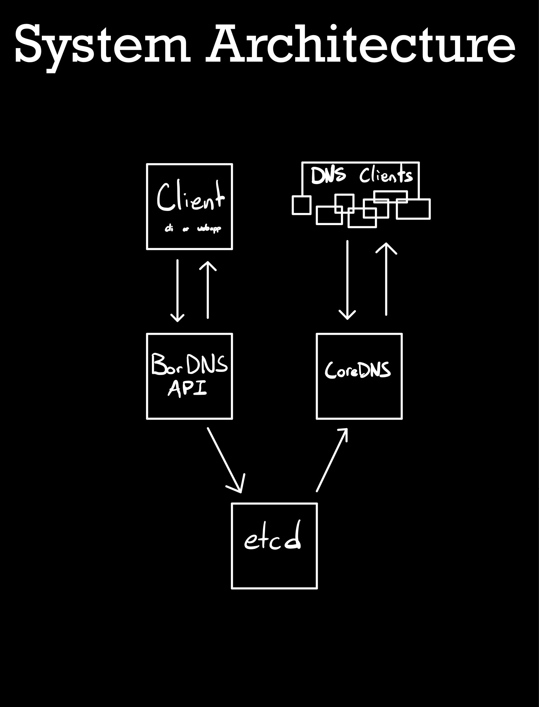

# BorDNS
Isaac Thiessen

Sun Apr 12 09:48:06 PDT 2020

### Contents
- [Description](##Description)
- [Configuring](##Configuring)
- [Kubernetes](##Kubernetes)
- [Docker](##Docker)
- [Architecture](##Architecture)

---------------------------------------------------

## Description
  Boreal DNS (BorDNS). A REST API management system for CoreDNS.

## Configuring
Environment Variable Required:

  `CONFIG = (path to config)`

Config example in src/github.com/fargusplumdoodle/bordns/config.yml

## Kubernetes:

Example configuration in `./kubernetes`. Instructions in `./kubernetes/README.md`

## Docker
An example script for running the BorDNS API alone: `scripts/docker_run_bordns_test.sh`

But the BorDNS API is fairly useless without etcd and CoreDNS.
You can start the 3 of them with `docker-compose up`
from the root of this repository

## Architecture

BorDNS is a webservice written in Golang to perform
CRUD operations on A records stored in ETCD for consumption
by a CoreDNS server.

I have packaged it all up so they should be easy to run together
with either docker-compose or kubernetes.

This was a fun weekend project that I have been meaning to do for a
while. I may add more with time.

